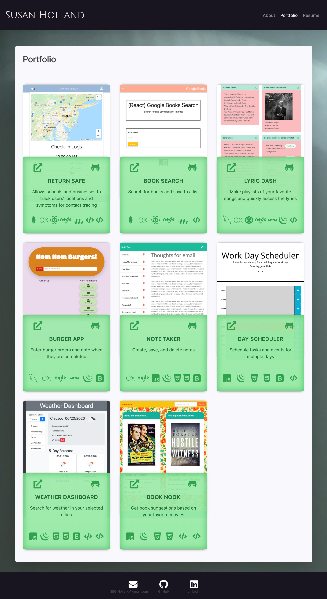
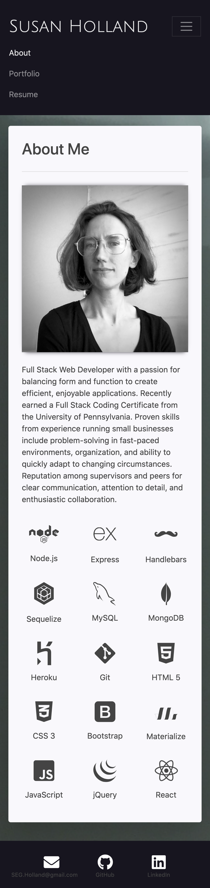

# SEGHPortfolio

  

  [Deployed App](https://segh.herokuapp.com)

  ## Description
  This is a React app portfolio to showcase my web development projects. I used the reactstrap node module for a css framework and the react router dom for routing.

  ### 1025 px

     

  ### 768 px

     

  ### 375 px

     

  ## Questions
  Please contact me with any questions through my GitHub profile [SEGH](https://github.com/SEGH) or [email](mailto:segh@fastmail.com)
